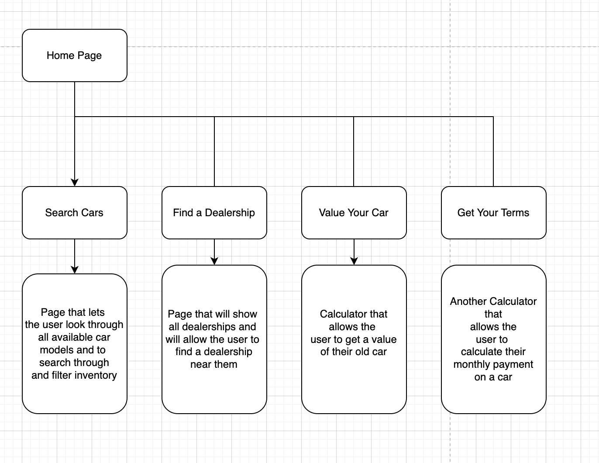
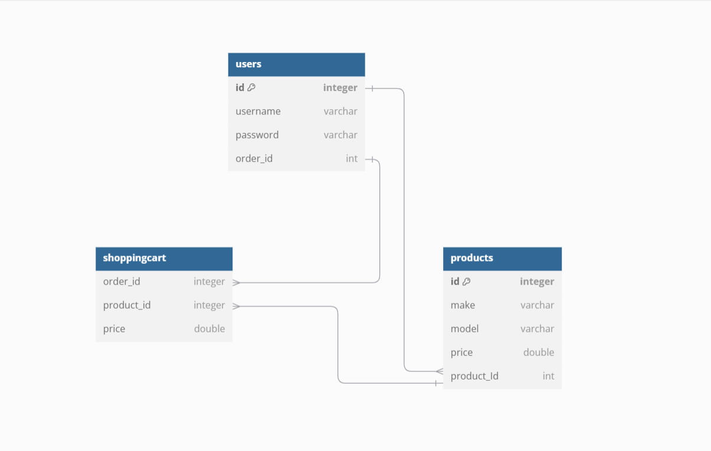
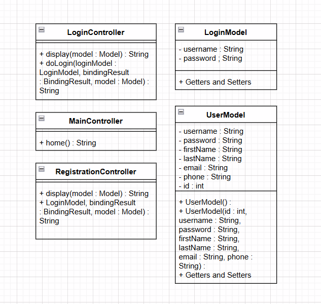
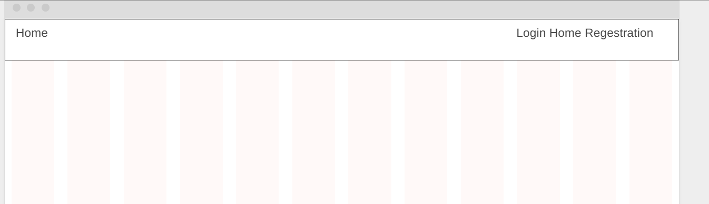
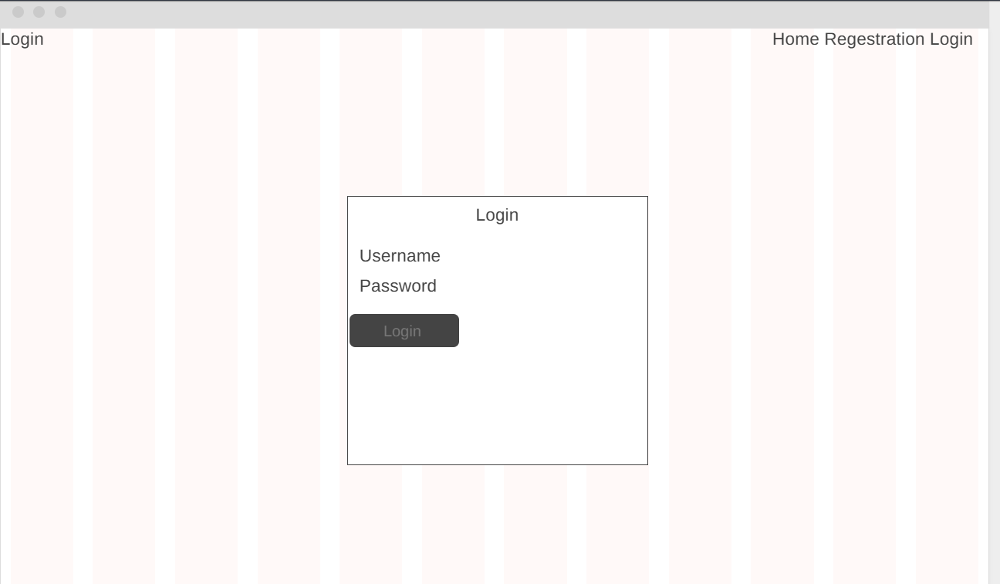
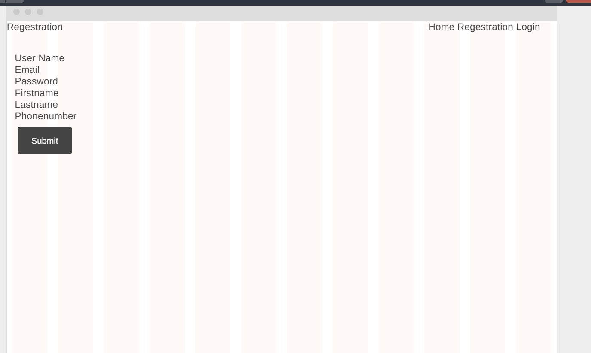

# CLC Project Overview

## 1. A detailed write-up describing what domain and products will be managed by the application.

The DriveTime app is a Java-based system for managing new and used car sales. This application will handle activities such as CRUD operations, managing used/new car sales, vehicle information, and general reporting. The products will have certain variables that determine what they are.

- Make: The car manufacturer or brand (e.g., Toyota, Ford, BMW).
- Model: The specific model of the car (e.g., Corolla, Mustang, X5).
- Year: The year the car was manufactured.
- Color: The color of the car.
- ID: (Vehicle Identification Number): A unique identifier for each vehicle.
- Mileage: The total distance the car drives (important for used cars).
- Price: The sale price of the car.
- Condition: Whether the car is new or used.
- Car Type: The type of car (e.g., sedan, SUV, truck, coupe).
- Fuel Type: The type of fuel used (e.g., gasoline, electric, hybrid).
- Warranty: Applicable only to new cars, including the duration and coverage details.

## 2. High-level Features and Functionality of Application
- The application will implement a user registration module and a login module.

- The application will be designed using an N-Layer architecture, with distinct and separate presentation components, business services, and persistence services.

- The application will adhere to industry best practices, exception handling, and error handling as discussed either in topic readings, and lectures. 
  - Presentation Spring MVC (Views, Models, and Controllers)
  - Spring Core (Business and Data Services)
  - Spring Data JDBC (Persistence)
  - Spring Core (IoC and DI)
  - Spring REST Services (APIs)
  - Bootstrap (Responsive Design)
  - Spring Boot Embedded Tomcat (as a JAR)
  - MySQL (Relational Database)

- The application will perform data validation on all form data entry fields.

- The application will use the Bootstrap framework to support responsive design.
- The application will implement all CRUD methods needed to sell cars 
    - A page that lists all cars listings as a tabular report with the relevant data and images.
    - A page that allows an admin to create a new car listing.
    - A page that allows a user to display the details of a car listing. 
    - A page that allows an admin to update an existing car listing.
    - A page that allows an admin to delete an existing car listing.
- The application will use a relational database, PostgreSQL. 
- The application will use the Spring JDBC or Spring Data JDBC to access the database (we are not sure which to use yet, we will do more research and update this section when determined which we will use).
- The application will use Spring Beans to implement all business services and persistence services.
- The application will use proper declarative Spring annotations within all components and use dependency injection (DI) for all models, controllers, services, and resources required by the application.
- The application will be deployed using Spring Boot and use the embedded Tomcat (version 9.x or later).
- The application will not be able to access secure pages (all but the root, registration, and login pages) without first logging into the application. The application will automatically redirect the user to the login page if they try to access a secure page without first logging in. The application will be secured using Spring Security form-based authentication and a database.
- The APIs will not be anonymous, it will be secured using Spring Security.
- The application classes will be fully documented using JavaDoc format
- There will be two types of users, admins, and standard users. Admins can create and edit listings whereas users can browse the listings and put in offers on vehicles.
- When a user attempts to purchase a car it will direct them to checkout which will get their credit information and determine a monthly payment that the user will pay. If they accept it will collect credit card details or bank details.
- The user will be able to browse and sort cars by certain properties, when they find one they are interested in they can click on it to bring up more information about the car.

## 3. Sitemap

This is the sitemap for our beautiful and fantastic website in the making

## 4. Project Management and work distribution

- We will try to use a traditional SCRUM work cycle. 

- We are going to meet on Wednesdays after class at 5:00 PM

- During this meeting, we will essentially do spring planning for the next week (Sprint).

- We will assign tickets to each team member for the next week

- Team members will work on their tickets until Friday

- We will conduct our Final meeting of the week after class on Friday and discuss the previous spring / finalize our work for submission.

## 5. Risks of the Project

There are several of different risks that can arise in the process of this project. For starters, we need to be aware of the merge conflicts that can arise when pushing and pulling all of our commits. With the correct protocols, we can avoid this issue. Another risk/issue that we can avoid is reaching a point where the code is unmaintainable. We can avoid this by making readable code, and following industry practices to make our lines of code as efficient and clean as possible. These precautions will not only ensure the safety and of our project, but our future projects in the work place as we instill proper programming etiquette and protocols.

## 6. ER Diagram

Rough draft of ER diagram for the database.

## 7. Class Diagrams

## 8. User Interface Diagrams

## 9. Database Queries to Create the MySQL Database (with dummy data)

CREATE DATABASE car_store;

USE car_store;

CREATE TABLE users (
id INTEGER PRIMARY KEY,
username VARCHAR(255) NOT NULL,
password VARCHAR(255) NOT NULL,
order_id INTEGER
);

CREATE TABLE products (
id INTEGER PRIMARY KEY,
make VARCHAR(255) NOT NULL,
model VARCHAR(255) NOT NULL,
price DOUBLE NOT NULL,
product_Id INTEGER
);

CREATE TABLE shoppingcart (
order_id INTEGER,
product_id INTEGER,
price DOUBLE,
PRIMARY KEY (order_id, product_id), 
FOREIGN KEY (order_id) REFERENCES users(id),
FOREIGN KEY (product_id) REFERENCES products(id)
);

INSERT INTO users (id, username, password, order_id) VALUES
(1, 'john_doe', 'password123', 1001),
(2, 'jane_smith', 'mypassword', 1002),
(3, 'mark_wilson', 'securepass', 1003),
(4, 'linda_jones', 'password789', 1004),
(5, 'alice_murray', 'supersecret', 1005);

INSERT INTO products (id, make, model, price, product_Id) VALUES
(1, 'Toyota', 'Corolla', 20000.00, 1),
(2, 'Honda', 'Civic', 22000.00, 2),
(3, 'Ford', 'Mustang', 30000.00, 3),
(4, 'Chevrolet', 'Camaro', 32000.00, 4),
(5, 'Tesla', 'Model 3', 40000.00, 5),
(6, 'BMW', '3 Series', 45000.00, 6),
(7, 'Audi', 'A4', 42000.00, 7),
(8, 'Mercedes', 'C-Class', 47000.00, 8),
(9, 'Nissan', 'Altima', 23000.00, 9),
(10, 'Mazda', 'CX-5', 28000.00, 10);

INSERT INTO shoppingcart (order_id, product_id, price) VALUES
(1, 1, 20000.00),
(1, 2, 22000.00),
(2, 3, 30000.00),
(2, 4, 32000.00),
(3, 5, 40000.00),
(3, 6, 45000.00),
(4, 7, 42000.00),
(4, 8, 47000.00),
(5, 9, 23000.00),
(5, 10, 28000.00);

## Youtube Links for Milestones

### Milestone 3 video
https://youtu.be/jtkcblgqk4o
